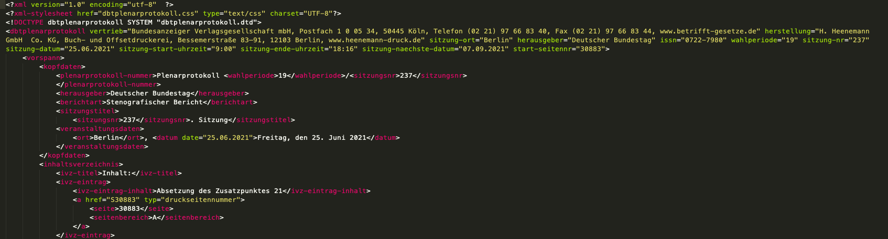
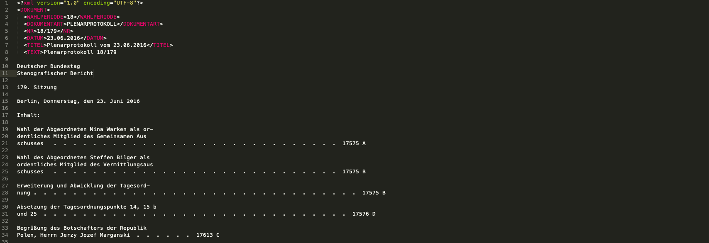

# Subject

The subject for our fulltext search are the speeches of the _Bundestag_. This set of data was chosen due to its Open Data nature combined with the size of the dataset and the fact that these protocols are recorded live into an XML formatted document. 

The XML format _should_ mean, that these files are easier to parse, but this was not always the case. There's a clear distinction between the 19th legistlative period and the 18th and earlier periods.

This first example is an example from the 19th period. The document follows the XML structure well and provides good groundwork to allow easy parsing.

This second example is an example from the 18th period. Without the few XML tags at the start of the document, it would be impossible to tell that this is indeed an XML file and not a plain text file. This made these documents quite a lot more difficult to parse.

For more information about these problems and their solutions, please find the documentations about these respective components.
